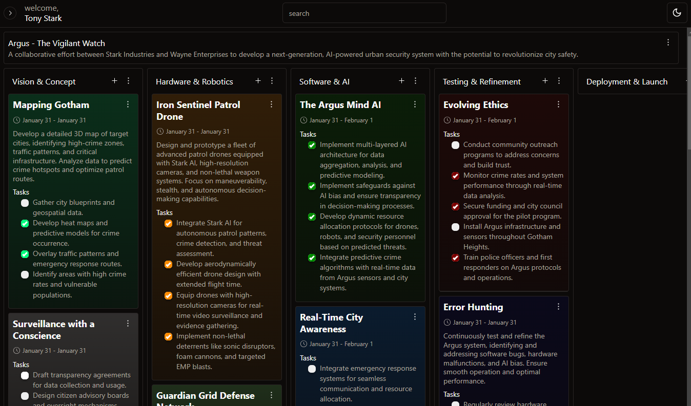

# [Waera Task Management](https://waera-task-management.vercel.app/)

   A Kanban board-style task manager with a digital canvas for colourful "sticky notes". Intuitive drag-and-drop, real-time updates, and collaboration. Built with React frontend, node Express js backend and postgresql database

[](https://waera-task-management.vercel.app/)

> **Warning**
> This project is a hobby/portfolio project and is still in development.
>

## Tech Stack

- **Client Framework:** [React]
- **Server Framework:** [Express]
- **Database:** [PostgreSQL]
- **WYSIWYG Editor:** [Blocknote](https://www.blocknotejs.org)
- **Styling:** [Tailwind CSS](https://tailwindcss.com)
- **User Management:** [Json Web Tokens]
- **ORM:** [Sequelize]
- **UI Components:** [shadcn/ui](https://ui.shadcn.com)
- **File Uploads:** [Multer](https://github.com/expressjs/multer) and [React Dropzone](https://github.com/zenoamaro/react-quill)

## Features to be implemented

- [x] ORM using **Sequelize**
- [x] Validation with **Zod**
- [ ] File uploads with **uploadthing**
- [ ] Authentication with **0Auth**
- [ ] Authentication with **Clerk**


# Running Locally

1. Clone the repository

   ```bash
   git clone https://https://github.com/whoisrobb/waera-task-management.git
   ```


## Server (Express JS, Javascript)

1. Navigate to the client directory

   ```bash
   cd server
   ```

2. Install dependencies using npm

   ```bash
   npm install
   ```

3. Create a `.env` file in the root directory of the project and set the following environment variables:

    ```plaintext
    JWT_SECRET=random_50+_character_string
    DATABASE_URL=your_database_url
    ```

    Replace `your_database_url` and `random_50+_character_string` with appropriate values.

4. Run the app

   ```bash
   npm start
   ```


## Frontend (React, Typescript)

1. Navigate to the client directory

   ```bash
   cd client
   ```

2. Install dependencies using npm

   ```bash
   npm install
   ```

3. Navigate to /src/lib/utils.ts and modify the server url to your local server url 

   ```typescript
   export const serverUrl = your_local_server_url;
   ```

   Replace ` your_local_server_url` with the appropriate value.

4. Run the app

   ```bash
   npm run dev
   ```
   